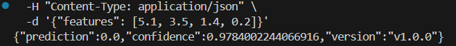

# ML Service — Blue-Green Deployment с Nginx

Проект реализует REST-сервис для ML-модели с поддержкой **Blue-Green Deployment**, **автоматической сборки через GitHub Actions** и **управлением версиями модели**.

## Архитектура

- **ML-сервис (FastAPI)** — обрабатывает запросы инференса
- **Две версии модели**:
  - **Blue**: `v1.0.0` → порт `8082`
  - **Green**: `v1.1.0` → порт `8081`
- **Nginx** — выступает в роли reverse proxy и балансировщика
- **Единый `docker-compose.all.yml`** — запускает все компоненты
- **GitHub Actions** — собирает и публикует Docker-образ в GHCR

---

##  Эндпоинты

| Метод | Путь                  | Описание                     |
|-------|-----------------------|------------------------------|
| GET   | `/health`             | Возвращает статус и версию модели |
| POST  | `/predict`            | Принимает `{"x": [1,2,3]}`, возвращает предсказание |

> Сервис доступен по **http://localhost:8086** (Nginx проксирует на активную версию).

## Локальный запуск

1. Соберите и запустите все сервисы:

```bash
docker-compose -f docker-compose.all.yml up --build -d
```

## Проверка работоспособности

curl http://localhost:8086/health <br>


curl -X POST http://localhost:8086/predict \ <br>
  -H "Content-Type: application/json" \ <br>
  -d '{"x": [1,2,3]}' <br>



## Переключение между Blue и Green

1. Откройте файл nginx.conf <br>
2. Найдите блок <br>
    upstream ml_backend {  <br>
    server mlservice_blue:8080;  # ← активная версия <br>
    #server mlservice_green:8080; <br>
    } 
3. Закомментируйте строку с mlservice_blue, раскомментируйте mlservice_green <br>
4. Перезагрузите Nginx: docker-compose -f docker-compose.nginx.yml up --build -d <br>

##  Docker и CI/CD
- Базовый образ: python:3.11-slim <br>
- При пуше в main: <br>
    - Собирается образ ghcr.io/<user>/<repo>:<commit-sha> <br>
    - Публикуется в GitHub Container Registry (GHCR) <br>
    - Образ можно использовать для деплоя в облако <br>
    - Секреты (GITHUB_TOKEN) используются безопасно через GitHub Actions. <br>